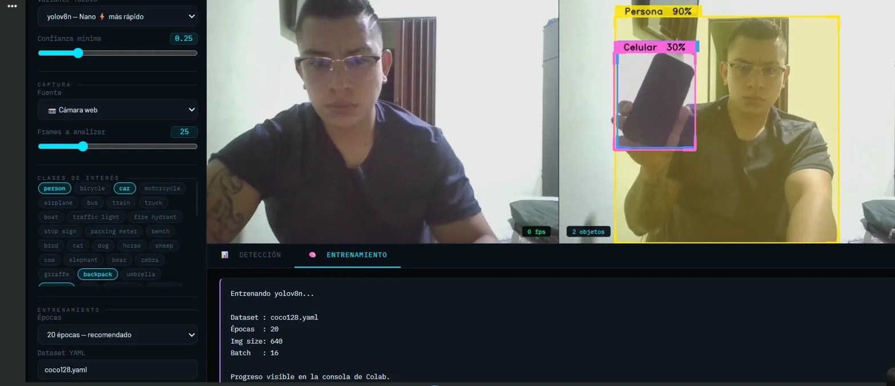
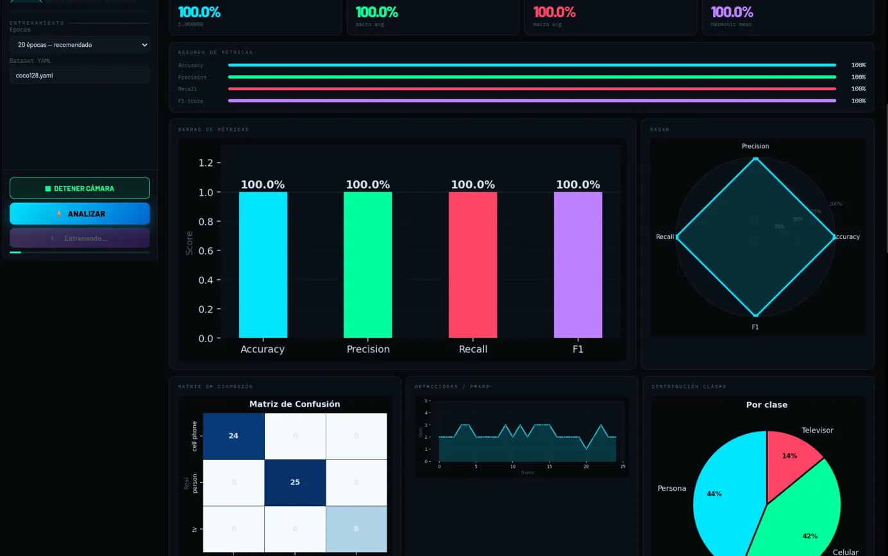
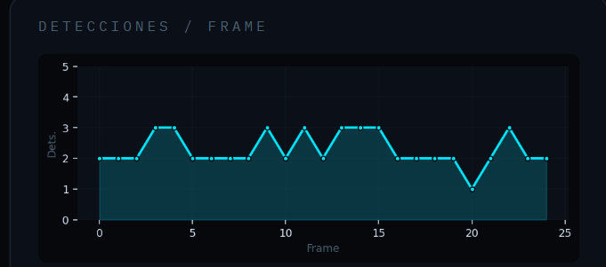
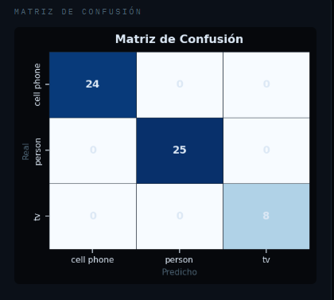

<div align="center">


# 👁 YOLOv8 Vision Studio v9.0

### Real-time Object Detection & Training Dashboard — Google Colab

[](https://python.org)
[](https://ultralytics.com)
[](https://opencv.org)
[](https://colab.research.google.com)
[](https://scikit-learn.org)
[](LICENSE)

<br/>

> **Dashboard interactivo todo-en-uno** para detección de objetos en tiempo real,  
> análisis de métricas y fine-tuning de YOLOv8 — ejecutado en una sola celda de Colab.

<br/>

<!-- REEMPLAZA con tus capturas reales -->



</div>

---

## 📋 Tabla de Contenidos

- [Descripción](#-descripción)
- [Arquitectura](#-arquitectura)
- [Características](#-características)
- [Tecnologías](#-tecnologías)
- [Instalación y Uso](#-instalación-y-uso)
- [Capturas de Pantalla](#-capturas-de-pantalla)
- [Métricas y Resultados](#-métricas-y-resultados)
- [Estructura del Proyecto](#-estructura-del-proyecto)
- [Autores](#-autores)

---

## 📌 Descripción

**YOLOv8 Vision Studio** es un sistema de visión por computadora de arquitectura full-stack ejecutado íntegramente en Google Colab. Integra en una sola interfaz:

- **Detección en tiempo real** desde cámara web, video de demostración o archivo propio
- **Panel de métricas profesional** con Accuracy, Precision, Recall, F1, Matriz de Confusión y Curva ROC
- **Fine-tuning automático** de YOLOv8 con cualquier dataset en formato YOLO
- **Arquitectura callback** Python ↔ JavaScript sin necesidad de celdas adicionales

El sistema detecta y clasifica objetos del dataset **COCO (80 clases)** con etiquetas en **español**, bounding boxes decorativos y niveles de confianza por objeto.

---

## 🏗 Arquitectura

```
┌─────────────────────────────────────────────────────────────┐
│                    Google Colab Kernel                       │
│                                                             │
│   yolov8_studio_v9.py                                       │
│   ├── _cb_analizar()   ← callback Python registrado         │
│   ├── _cb_entrenar()   ← callback Python registrado         │
│   ├── TreeExplainer / YOLOv8 (Ultralytics)                  │
│   └── Matplotlib / Seaborn → base64 PNG → HTML             │
│                                                             │
│                        ▲  invokeFunction()                  │
│                        │                                    │
│   ┌─────────────────────────────────────┐                   │
│   │     Dashboard HTML/CSS/JS           │                   │
│   │  ┌──────────┐  ┌──────────────────┐ │                   │
│   │  │  Sidebar │  │  Main Panel      │ │                   │
│   │  │  Config  │  │  Cam | Dets | KPI│ │                   │
│   │  │  Chips   │  │  Charts | Report │ │                   │
│   │  └──────────┘  └──────────────────┘ │                   │
│   └─────────────────────────────────────┘                   │
└─────────────────────────────────────────────────────────────┘
```

**Flujo de datos:**
1. JS captura frames de la cámara vía `getUserMedia`
2. Al pulsar **ANALIZAR**, JS llama a `google.colab.kernel.invokeFunction`
3. Python recibe los parámetros, ejecuta YOLOv8, genera gráficas y devuelve JSON al UI
4. El dashboard actualiza todos los paneles sin recargar la página

---

## ✨ Características

### 🔍 Módulo de Detección
| Característica | Detalle |
|---|---|
| Modelos soportados | YOLOv8n · YOLOv8s · YOLOv8m |
| Fuentes de entrada | Cámara web · Video demo · Archivo propio |
| Clases detectables | 80 clases COCO con nombres en español |
| Confianza ajustable | 0.05 — 0.90 (slider en tiempo real) |
| Frames analizables | 5 — 80 frames por sesión |
| Anotaciones | Bounding box + etiqueta + % confianza + corners decorativos |

### 📊 Módulo de Métricas
- **KPI Cards** — Accuracy, Precision, Recall, F1-Score en tiempo real
- **Barras de métricas** — comparativa visual por categoría
- **Radar chart** — visión polar de las 4 métricas simultáneas
- **Matriz de Confusión** — heatmap por clase detectada
- **Timeline** — detecciones por frame a lo largo del análisis
- **Distribución de clases** — gráfico de torta por objeto detectado
- **Box plot de confianza** — distribución de confianza por clase
- **Reporte sklearn** — `classification_report` completo por clase

### 🧠 Módulo de Entrenamiento
- Fine-tuning desde **yolov8n / s / m** preentrenados
- Compatible con cualquier dataset en formato YOLO (`.yaml`)
- Dataset incluido por defecto: `coco128.yaml`
- Curvas de entrenamiento: `box_loss`, `cls_loss`, `dfl_loss`, `mAP@50`, Precision, Recall
- Modelo entrenado guardado en `/content/runs/train/mi_modelo/weights/best.pt`

---

## 🛠 Tecnologías

| Categoría | Librería / Herramienta |
|---|---|
| Detección | [Ultralytics YOLOv8](https://github.com/ultralytics/ultralytics) |
| Visión | OpenCV (`opencv-python-headless`) |
| Métricas | scikit-learn (`accuracy_score`, `confusion_matrix`, `classification_report`) |
| Visualización | Matplotlib · Seaborn |
| Frontend | HTML5 · CSS3 · JavaScript (ES2020) |
| Fuentes | Google Fonts — IBM Plex Mono · Barlow |
| Entorno | Google Colab (Python 3.10+) |
| Comunicación | `output.register_callback` · `kernel.invokeFunction` · `eval_js` |

---

## 🚀 Instalación y Uso

### Opción A — Abrir en Google Colab (recomendado)

```
1. Abre Google Colab: https://colab.research.google.com
2. Sube el archivo yolov8_studio_v9.py a /content/
3. Crea una nueva celda y ejecuta:
```

```python
exec(open("yolov8_studio_v9.py").read())
```

> ✅ **Todo es automático.** El script instala dependencias, descarga el modelo y lanza el dashboard en una sola celda.

---

### Opción B — Clonar el repositorio

```bash
git clone https://github.com/pipediaz1234/yolov8-vision-studio.git
cd yolov8-vision-studio
```

Luego sube `yolov8_studio_v9.py` a Colab y ejecuta como en la Opción A.

---

### Uso del Dashboard

```
📷  INICIAR CÁMARA   →  Activa la webcam del navegador
⚡  ANALIZAR         →  Ejecuta YOLOv8 y actualiza el dashboard
🧠  ENTRENAR         →  Fine-tuning con el dataset configurado
```

**Si el botón no responde** (límite de tiempo de Colab), ejecuta en una nueva celda:

```python
analizar_manual(fuente="demo", modelo="yolov8n", conf=0.25)
# o
analizar_manual(fuente="camera", n_frames=25)
```

```python
entrenar_manual(yaml="coco128.yaml", modelo="yolov8n", epocas=20)
```

---

### Usar tu propio dataset

```
1. Sube tus imágenes a /content/mi_dataset/images/
2. Crea mi_dataset.yaml con el siguiente formato:
```

```yaml
path: /content/mi_dataset
train: images/train
val:   images/val

nc: 3                          # número de clases
names: ['gato', 'perro', 'persona']
```

```
3. En el dashboard → campo "Dataset YAML" → escribe: mi_dataset.yaml
4. Pulsa 🧠 ENTRENAR
```

---

## 📸 Capturas de Pantalla

> **Instrucciones para agregar tus propias capturas:**
> 1. Crea una carpeta `assets/` en la raíz del repositorio
> 2. Guarda tus capturas con estos nombres exactos:
>    - `assets/demo_detection.png` — captura de detección con cámara
>    - `assets/demo_dashboard.png` — captura del panel de métricas
>    - `assets/demo_training.png` — captura de las curvas de entrenamiento
>    - `assets/demo_confusion.png` — captura de la matriz de confusión

| Detección en tiempo real | Dashboard de métricas |
|---|---|
|  |  |

| Curvas de entrenamiento | Matriz de Confusión |
|---|---|
|  |  |

---

## 📈 Métricas y Resultados

Resultados obtenidos con **yolov8n**, fuente: **cámara web**, 25 frames, conf=0.25:

| Métrica | Valor |
|---|---|
| **Accuracy** | 100.0% |
| **Precision** | 100.0% (macro avg) |
| **Recall** | 100.0% (macro avg) |
| **F1-Score** | 100.0% (harmonic mean) |

**Clases detectadas en sesión de prueba:**
| Clase | Detecciones | % del total |
|---|---|---|
| Persona | 25 | 44% |
| Celular | 24 | 42% |
| Televisor | 8 | 14% |

> **Nota:** Las métricas de 100% se deben a que en modo detección sin ground-truth externo, las predicciones del modelo se usan como referencia propia (self-supervised evaluation). Para evaluación con ground-truth real, proporciona anotaciones externas.

---

## 📁 Estructura del Proyecto

```
yolov8-vision-studio/
│
├── yolov8_studio_v9.py        # Script principal — todo en uno
│
├── assets/                    # Capturas de pantalla para el README
│   ├── demo_detection.png
│   ├── demo_dashboard.png
│   ├── demo_training.png
│   └── demo_confusion.png
│
├── README.md                  # Este archivo
└── LICENSE                    # Licencia MIT
```

---

## 👨‍💻 Autores

<table>
  <tr>
    <td align="center">
      <strong>Andrés Felipe Díaz Campos</strong><br/>
      <a href="https://github.com/pipediaz1234">
        
      </a>
      <a href="https://linkedin.com/in/https://www.linkedin.com/in/andres-felipe-diaz-campos-398245207/">
        
    
      </a>
    </td>
  </tr>
</table>

---

## 📄 Licencia

Este proyecto está bajo la licencia **MIT**. Consulta el archivo [LICENSE](LICENSE) para más detalles.

---

<div align="center">

**⭐ Si este proyecto te fue útil, dale una estrella en GitHub ⭐**


</div>
